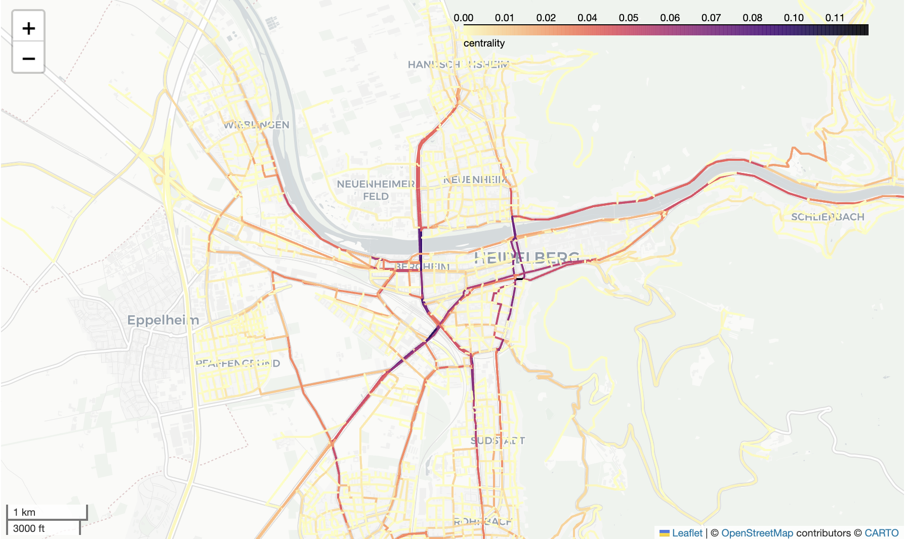

# Final project - Network Analysis: 

## Introduction: Geographically Informed Betweenness Centrality

Betweenness centrality is an indicator to identify important nodes or edges in graph networks. Originally it was developed for social networks (e.g. facebook). Applied to road networks this can be used to model traffic speed or identify critical roads to support disaster preparedness. Still, open challenges remain on how to integrate the geographical context of road networks (e.g. road type, spatio-temporal travel patterns) and how to efficiently calculate centrality indicators for such complex networks.



### How is betweenness centrality calculated?

#### Original betweenness centrality (e.g. for social networks)

1. Calculate the shortest routes between all nodes in the network graph. 
2. Count how many times each edge is contained in the routes.  

#### Adapting betweenness centrality to geographical space 

- Calculate the fastest route instead of the shortest. 
- Calculate only a sample of routes and choose the start and end points of the routes based on population distribution.

### Calculating betweenness centrality using Python

There are different Python packages for network analysis which include functions to calculate betwenness centrality, e.g.  

- osmnx: Create graph network based on OSM data 
- NetworkX: Calculate centrality 
- NetworKit: Calculate centrality

## Getting Started

Take a look at the [jupyter notebook ./src/betweenness_centrality.ipynb](./src/betweenness_centrality.ipynb) for a brief introduction and learn how to calculate betweenness centrality. In the notebook, different methods (networkx or geographical) were implemented for the calculation of centrality based on two different weights, length and travel time. In addition, a weighted approach was integrated into the bonus section, which is based on the population distribution in the region.

A Python program, including a main script, different modules and some unit tests, was written which calculates betweenness centrality based on OpenStreetMap data for a selected study area and using thereby different calculation methods. It can be executed from the command line.

### Installation & Dependencies 

Set up an adequate python environment, including the following packages:
- pandas
- numpy
- matplotlib
- geopandas
- shapely
- osmnx
- networkx

```
e.g. conda install -c conda-forge osmnx networkx
```

For the population distribution, the free and open Global Human Settlement Layer (epoch: 2020, resolution: 100 m) was used. The data can be accessed at the [following website](https://ghsl.jrc.ec.europa.eu/download.php?ds=pop). 
The raster data was downloaded, merged and reprojected for the area of Germany using QGIS. The resulting grid was stored in the data folder. 

### Project folder structure 

The folder and files in this repository are arranged in the following way:

```
- src
    - tests
        - __init__.py
        - test_column_osmi_gdf.py
        - test_networkx_centrality_output.py
        - test_point_in_polygon.py
    - modules
        - module_create_region.py
        - module_output_folder.py
        - module_networkx_centrality.py
        - module_geographical_centrality.py
    - data
        - GHS_POP_100m_2020.tif
    __init__.py
    Main.py
    betweenness_centrality.ipynb
- README.md
- Research_questions.ipynb
- img
    - centrality.png
    - Video_Command_line_geographical.mp4
    - Video_Command_line_networkx.mp4
    - ...
```

### Program input 

The program is executable from the command line with the following input parameters
  - Study area, e.g. `Heidelberg, Germany`
  - Method to calculate centrality, e.g. `networkx` or `geographical`
  - Route type, e.g. shortest or fastest
  - Number of routes (for the geographical method)

The selection or creation of an output folder is offered to the user in a new popup window when the program is executed. 

### Program example

- Activate the python environment and navigate to the corresponding folder structure
- The program can be executed with the following command: `python Main.py <region> <module_type> <weight> [number_of_routes]`
- The region must not contain any spaces, an example of a successful entry is `Heidelberg,Germany`.
- The module type can be differentiated between `networkx` and `geographical`, the weight between `length` and `travel_time`.
- The number of routes is only relevant when using the module type "geographical".

Two different successfull examples for program execution are:
```
python Main.py Wiesenbach networkx length
```
```
python Main.py Heidelberg,Germany geographical travel_time 50
```

4 different calculation methods are available: networkx length, networkx travel_time, geographical length and geographical travel_time.

How to execute the program from your command line can be seen in the video below.

__Centrality calculation networkx:__


__Centrality calculation geographical:__


### Program output

The following files will be created in the output folder: 

- GeoPackage containing the graph network including a column called 'centrality' which contains the calculated centrality index for each road segment.
- Image (as .png) showing the betweenness centrality of the study area

### Run the tests

There are three unit tests which are located in the tests folder. They can also be executed from the command line by navigating into the 05_network_analysis folder and using the following command:

```
python -m unittest src.tests.test_point_in_polygon
```
### Answering the research questions

The research questions regarding the different calculation methods for centrality were answered in a jupyter notebook. These were emphasized with corresponding figures.

## Authors

Johannes Grünewald & Maximilian Schäfer
